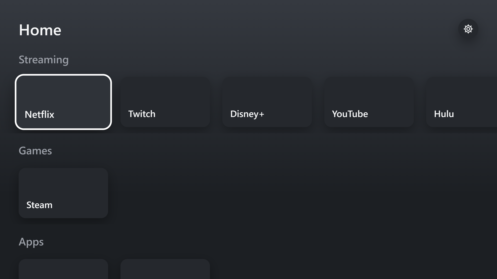

# Living Room Launcher

A console-style, fullscreen home screen for a Windows living-room PC. It starts with Windows and shows your streaming services, games and apps as big tiles you can browse from the couch with a keyboard or mouse.

<!-- Add a screenshot: save one as docs/screenshot.png and uncomment the line below -->


## Features

- **Console-style home screen** with tiles grouped into rows by category (Streaming, Games, Apps)
- **Keyboard and mouse navigation**: arrow keys to move, Enter to launch, Esc to go back
- **Three launch types**
  - **Website**: opens fullscreen in its own Edge app window, with no tabs or address bar
  - **Program**: runs a `.exe` (games, apps)
  - **Link**: opens a protocol link, such as Steam (`steam://open/bigpicture`)
- **Built-in Settings screen** to add, edit, reorder and remove tiles, with a Windows file picker for programs
- **Custom tile art** from a local images folder
- **Starts with Windows**, and only ever runs one copy
- **Ctrl+Alt+Home** brings the launcher back from anywhere, even inside a game
- **Hides the mouse cursor** when it's idle
- **Respects the Windows "Animation effects" setting**

## Requirements

- Windows 10 or 11 (64-bit)
- Microsoft Edge and WebView2, both included with Windows 10 and 11

## Installation

1. Download the latest `Living Room Launcher_x.y.z_x64-setup.exe` from the [Releases](../../releases) page, or build it yourself (see [Building from source](#building-from-source)).
2. Run the installer. It installs for your Windows account only and doesn't need admin rights.
3. The installer isn't code-signed, so Windows may show **"Windows protected your PC."** Click **More info → Run anyway**.

The launcher opens after installing, and starts automatically every time you sign in to Windows. You can turn that off in **Task Manager → Startup apps**.

## Controls

| Key | Home | Settings |
|---|---|---|
| Arrow keys | Move between tiles | Move between items and fields |
| Enter | Launch the highlighted tile | Open options / confirm |
| Esc | — | Go back / cancel |
| Up from the top row | Highlight the Settings gear | — |
| **Ctrl+Alt+Home** | Return to the launcher from any app | |

In a fullscreen website window: **F11** toggles fullscreen, and **Alt+F4** closes it.

## Managing tiles

### With the Settings screen

Press **Up** from the top row to highlight the gear, then press **Enter**.

- **+ Add tile**: create a new tile. For programs, press Enter on **Choose program…** to pick a `.exe`.
- **Enter on a tile** opens its options: **Edit**, **Move up**, **Move down**, **Remove**.
- Every change is saved immediately.

### By editing the config file

Tiles are stored in:

```
%APPDATA%\com.ana.launcher\tiles.json
```

Example:

```json
{
  "tiles": [
    {
      "id": "netflix",
      "name": "Netflix",
      "category": "streaming",
      "image": "netflix.jpg",
      "launch": { "type": "url-app", "target": "https://www.netflix.com" }
    },
    {
      "id": "my-game",
      "name": "My Game",
      "category": "games",
      "launch": { "type": "exe", "target": "C:\\Games\\MyGame\\game.exe" }
    },
    {
      "id": "steam",
      "name": "Steam",
      "category": "games",
      "launch": { "type": "protocol", "target": "steam://open/bigpicture" }
    }
  ]
}
```

| Field | Rules |
|---|---|
| `id` | Unique. Lowercase letters, digits and dashes only. |
| `name` | Shown on the tile. |
| `category` | Each category becomes a row, in the order it first appears. Use lowercase. |
| `image` | Optional. A file name from the images folder (see below), not a path. |
| `launch.type` | `url-app`, `exe` or `protocol`. |
| `launch.target` | `url-app`: must start with `https://`. `exe`: a full path ending in `.exe`. `protocol`: currently only `steam://` links are allowed. |

In JSON, backslashes in paths must be doubled (`C:\\Games\\...`), or use forward slashes (`C:/Games/...`).

Restart the launcher after editing the file. If the file has a mistake, the launcher shows an error explaining what's wrong and where. The previous version is kept as `tiles.json.bak` whenever Settings saves.

### Tile images

Put images in:

```
%APPDATA%\com.ana.launcher\images\
```

and set a tile's `image` to the file name, like `netflix.jpg`. A **16:9** image around **1280×720** works best. JPG, PNG and WebP are supported. Tiles without an image show their name instead.

## Streaming services and logins

Websites open in a **dedicated Edge profile** stored in `%LOCALAPPDATA%\com.ana.launcher\edge-profile`. That keeps TV logins separate from your normal browsing, and makes fullscreen work reliably even if Edge is already open. You'll sign into each streaming service once in this profile; after that it remembers you.

Streaming sites are deliberately **not** embedded inside the launcher. Their video protection (DRM) blocks or degrades playback in embedded web views, so they always open in Edge instead.

## Games

The launcher can't force a game into fullscreen. Set your games to **borderless fullscreen** (sometimes called "windowed fullscreen") in their own display settings. That fills the screen and lets Ctrl+Alt+Home switch back instantly. Games in exclusive fullscreen can take a moment to switch.

## Security design

The launcher can start programs, so it's built so that the user interface can never run arbitrary commands:

- **The interface only sends a tile id** to launch something. The real target is looked up in the config by the Rust backend.
- **The interface never receives or sends program paths.** Program paths only come from the config file or from the Windows file picker, and the Settings screen refers to them through short-lived tokens.
- **Every config load and save is validated** with the same rules: `https://` only for websites, an allowlist for protocol links, absolute `.exe` paths, and plain file names for images.
- **No shell is used.** Programs are started directly, never through `cmd`.
- **Minimal permissions.** The interface has no access to Tauri's file, shell, dialog, opener or shortcut APIs. A Content Security Policy blocks external scripts, styles, images and network requests, and images can only be loaded from the images folder.
- **Config saves are atomic,** with a backup, so a crash can't leave a half-written file.

## Building from source

### Prerequisites (Windows)

1. [Microsoft C++ Build Tools](https://visualstudio.microsoft.com/visual-cpp-build-tools/), with the **Desktop development with C++** workload
2. [Rust](https://www.rust-lang.org/tools/install), using the MSVC toolchain (`x86_64-pc-windows-msvc`)
3. [Node.js](https://nodejs.org) LTS

See the [Tauri prerequisites](https://v2.tauri.app/start/prerequisites/) for details.

### Commands

```
npm install
npm run tauri dev        # run in development with hot reload
npm run tauri build      # build the installer
```

The installer is created in `src-tauri\target\release\bundle\nsis\`.

Run the backend tests with:

```
cd src-tauri
cargo test
```

Notes for development:

- **Autostart is only registered by release builds,** so `npm run tauri dev` doesn't add itself to Windows startup.
- **The Content Security Policy only applies to built versions,** because Vite's dev server needs to inject styles for hot reload. To test it, build with `npm run tauri build -- --debug --no-bundle` and run `src-tauri\target\debug\living-room-launcher.exe`.
- **Running the installed app on your development PC** registers it to start with Windows there too.

## Tech stack

- [Tauri 2](https://v2.tauri.app/): Rust backend, WebView2 on Windows
- React + TypeScript + Vite
- Plain CSS
- Tauri plugins: opener, dialog, single-instance, autostart, global-shortcut (all used from Rust only)

## Project structure

```
src/                       React frontend
  components/              Home rows, tiles, Settings screen and form
  input/                   Navigation actions and row movement
  settings/                Settings helpers (form, reordering, saving)
  hooks/                   Idle cursor
src-tauri/
  src/config.rs            Config model, validation, loading and saving
  src/launch.rs            Launching websites, programs and links
  src/settings.rs          Settings data and program tokens
  src/lib.rs               Commands, app state, plugins
  default-tiles.json       Starter config for new installs
  capabilities/            Frontend permissions (kept minimal)
  tauri.conf.json          Window, security and installer settings
```

## Roadmap

- [ ] Controller support through the browser Gamepad API, mapped onto the existing navigation actions

## License

[MIT](LICENSE) © 2026 Ana Garcia
